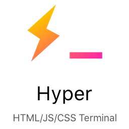

# Hyper

    

### A terminal built on web technologies

#### 📦 Packages List

**Productivity:**
- ✅ [HyperCwd](https://github.com/hharnisc/hypercwd)

**Customization:**
- ✅ [Tab Icons](https://github.com/dfrankland/hyper-tab-icons)
- ✅ [Hyper Material Vibrancy](https://github.com/danielheyman/hypermaterial-vibrancy)
- ✅ [Status Line](https://github.com/henrikdahl/hyper-statusline)
